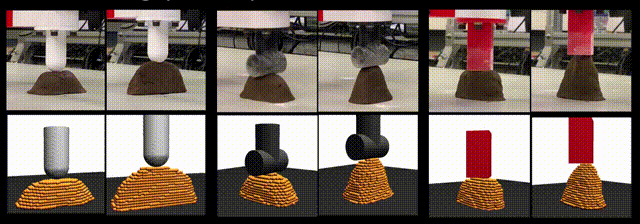
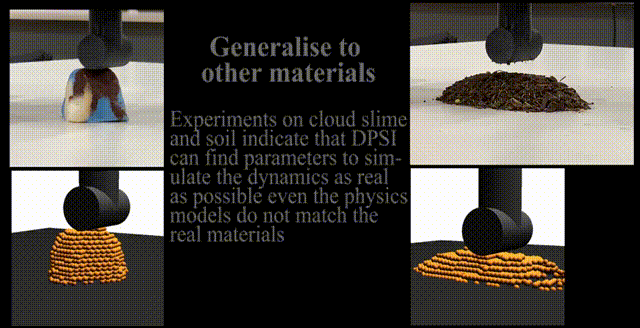
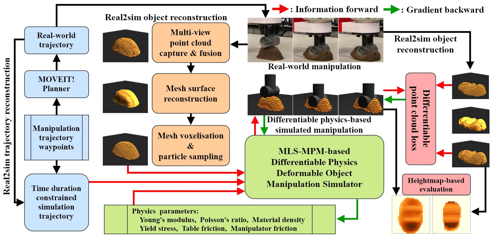

<h1 align="center">
Differentiable Physics-based System Identification for 

Robotic Manipulation of Elastoplastic Materials
</h1>

<h2 align="center">
Code: <a href="https://github.com/IanYangChina/SI4RP-data"></a>
Video: <a href="https://www.youtube.com/watch?v=2-9JWRsQhTU"></a>
Paper: <a href="https://journals.sagepub.com/doi/full/10.1177/02783649251334661"></a>
</h2>

<p align="center">
  
  
</p>

<h2 align="center"> Abstract </h2>

### Robotic manipulation of volumetric elastoplastic deformable materials, from foods such as dough to construction materials like clay, is in its infancy, largely due to the difficulty of modelling and perception in a high-dimensional space. Simulating the dynamics of such materials is computationally expensive. It tends to suffer from inaccurately estimated physics parameters of the materials and the environment, impeding high-precision manipulation. Estimating such parameters from raw point clouds captured by optical cameras suffers further from heavy occlusions. 
### To address this challenge, this work introduces a novel Differentiable Physics-based System Identification (DPSI) framework1 that enables a robot arm to infer the physics parameters of elastoplastic materials and the environment using simple manipulation motions and incomplete 3D point clouds, aligning the simulation with the real world. Extensive experiments show that with only a single real-world interaction, the estimated parameters, Young’s modulus, Poisson’s ratio, yield stress and friction coefficients, can accurately simulate visually and physically realistic deformation behaviours induced by unseen and long-horizon manipulation motions. Additionally, the DPSI framework inherently provides physically intuitive interpretations for the parameters in contrast to black-box approaches such as deep neural networks. 

<pre align="center">
  
  
</pre>

```bibtex
@article{yang2025differentiable,
  title={Differentiable physics-based system identification for robotic manipulation of elastoplastic materials},
  author={Yang, Xintong and Ji, Ze and Lai, Yu-Kun},
  journal={The International Journal of Robotics Research},
  volume={44},
  number={13},
  pages={2126--2155},
  year={2025},
  publisher={SAGE Publications Sage UK: London, England}
}
```
